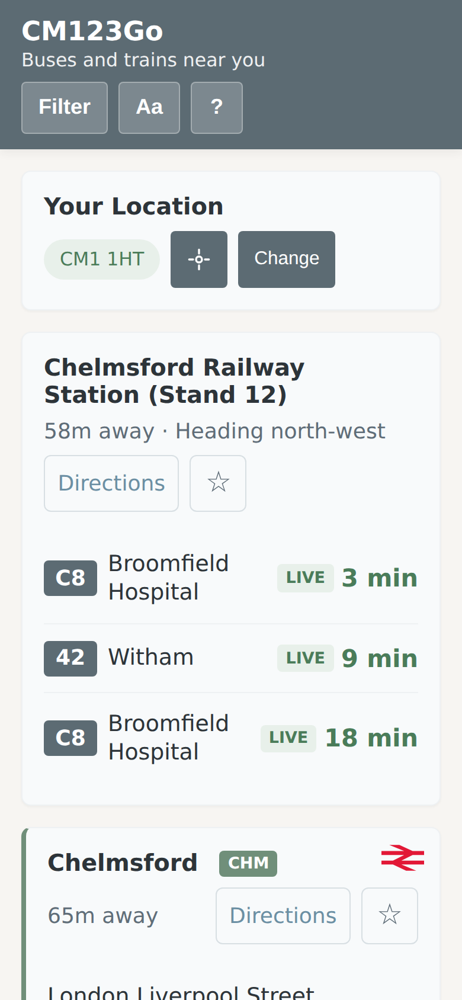
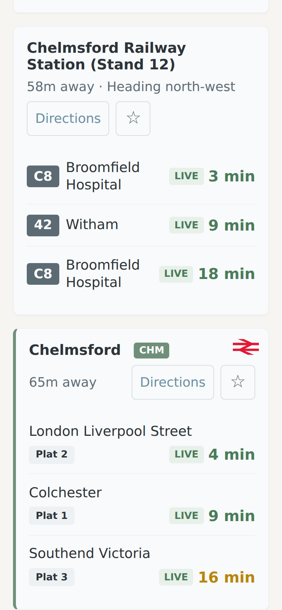
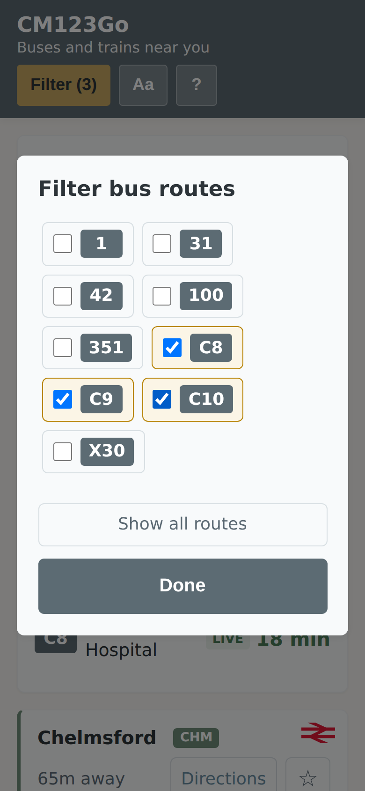
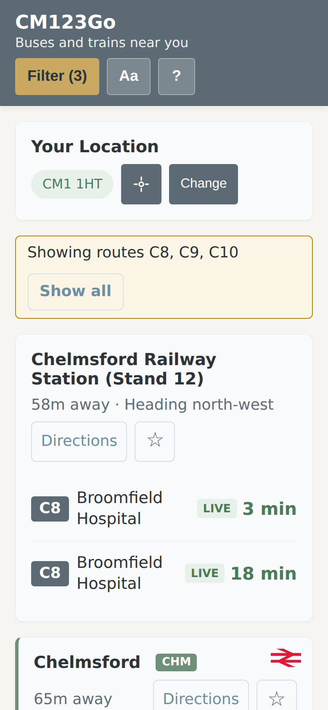
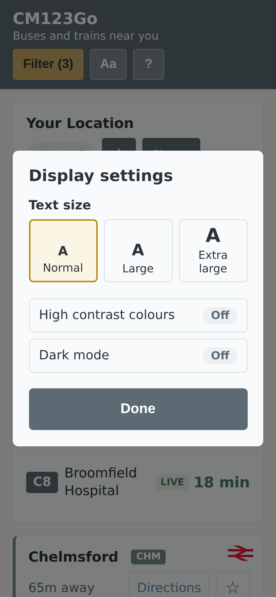
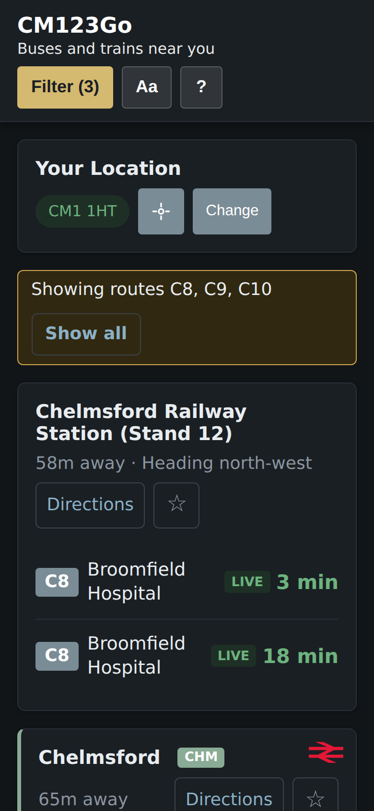

# cm123go

Live bus and train departures for Chelmsford, UK, on your phone. Open it and it shows the buses
and trains leaving near you - no app store or account needed.

<p align="center">
    
</p>

## Features

- **Nearby departures** - finds the closest bus stops in both directions, plus Chelmsford and
  Beaulieu Park stations, with live times where available
- **Route filter** - show only the routes you use, e.g. just the C8, C9 and C10
- **Favourites** - star a stop to keep it on screen wherever you are
- **Easy to read** - large text by default, three text sizes, high contrast colours and dark mode
- **Search further away** - widen the search if your bus isn't at the nearest stops
- **Postcode entry** - use a Chelmsford postcode instead of GPS; the app says so if you're outside
  the area it covers
- **Installable** - works as a Progressive Web App, and caches recent data for patchy signal

## Screenshots

|                    Nearby departures                    |                        Train stations                         |                      Filter by route                      |
| :-----------------------------------------------------: | :-----------------------------------------------------------: | :-------------------------------------------------------: |
|  |            |  |
|               **Filtered to C8, C9, C10**               |                     **Display settings**                      |                       **Dark mode**                       |
|    |  |     |

_Screenshots use sample departure data. Regenerate them, and the GIF, with `npm run demo`._

## Getting Started

```bash
npm install
cp app.config.example.json public/app.config.json   # then add your API keys
npm run dev
```

### API keys

| Key              | Used for                  | Get one from                                                                           |
| ---------------- | ------------------------- | -------------------------------------------------------------------------------------- |
| `bodsApiKey`     | Live bus positions (BODS) | [Bus Open Data Service](https://data.bus-data.dft.gov.uk/)                             |
| `railDataApiKey` | Live train departures     | [Rail Data Marketplace](https://raildata.org.uk) - "Live Arrival and Departure Boards" |

On Netlify, set `BODS_API_KEY` and `RAIL_DATA_API_KEY` as environment variables; the build writes
them into `app.config.json`.

## Scripts

| Command                 | Description                                             |
| ----------------------- | ------------------------------------------------------- |
| `npm run dev`           | Start development server                                |
| `npm run build`         | Production build                                        |
| `npm run preview`       | Preview production build                                |
| `npm test`              | Run tests in watch mode                                 |
| `npm run test:run`      | Run tests once                                          |
| `npm run test:coverage` | Generate coverage report                                |
| `npm run lint`          | Check for lint errors                                   |
| `npm run lint:fix`      | Fix lint errors                                         |
| `npm run format`        | Format code with Prettier                               |
| `npm run typecheck`     | TypeScript type checking                                |
| `npm run knip`          | Find unused code                                        |
| `npm run check`         | Run all checks                                          |
| `npm run update-stops`  | Regenerate bundled bus stops (NAPTAN + BODS timetables) |
| `npm run demo`          | Record README screenshots and demo GIF (needs ffmpeg)   |

## Project Structure

```
src/
├── main.ts          # Application entry point
├── api/             # External API clients (First Bus, BODS, rail, postcodes.io)
├── core/            # Business logic: stops, stations, location, service area, app state
├── ui/              # Rendering, event handlers, route filter, display settings, help
├── config/          # Configuration loading with Zod
├── utils/           # Logger, time, HTML escaping, caching and fetch helpers
└── types/           # Shared type definitions
scripts/             # Bus stop data refresh, config generation, demo recording
docs/                # README screenshots and demo GIF
```

## How It Works

1. Loads config and gets your location from the browser (or a postcode you enter)
2. Checks you're in the Chelmsford area, and shows your postcode (via postcodes.io)
3. Finds the nearest bus stops in both directions (up to 4), plus nearby train stations
4. Fetches departures with a fallback chain:
    - **First Bus API** - real-time for First Essex buses (primary)
    - **BODS SIRI-VM + GTFS** - vehicle positions + timetables (fallback)
    - **GTFS scheduled times** - static timetables (last resort)
5. Refreshes every 60 seconds while the page is visible

### External APIs

| API          | Purpose                      |
| ------------ | ---------------------------- |
| First Bus    | Real-time departure times    |
| BODS SIRI-VM | Real-time vehicle positions  |
| BODS GTFS    | Static timetable data        |
| Rail Data    | Live train departures        |
| NAPTAN       | Bus stop data (pre-bundled)  |
| postcodes.io | Geocoding (free, no API key) |

### Caching

Uses IndexedDB for an offline-first experience:

- Bus stops: 7 days
- Departures: 60 seconds
- Timetables: 1 day

Bus stop data is bundled in `public/bus-stops*.json` and refreshed weekly by a GitHub Action.

## License

MIT
